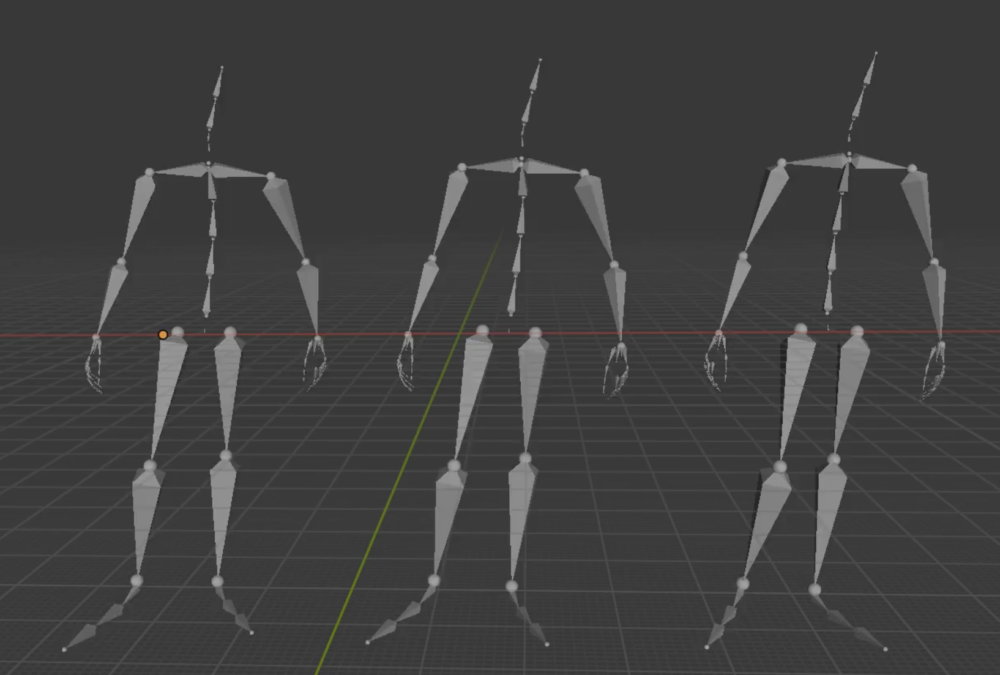
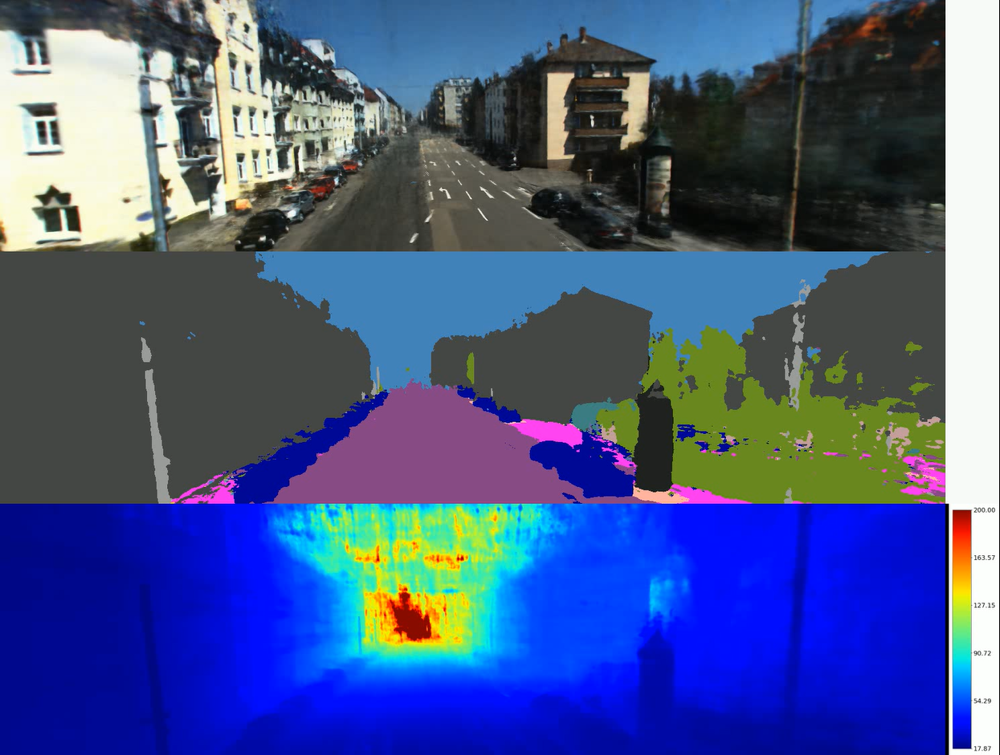

Hi, this is Yanling. I'm passionate about cutting-edge research in **3D Reconstruction and Generation**, as well as **Extended Reality (XR)**. My expertise spans a broad range of topics, including generative models (GANs, diffusion models), 3D vision techniques (NeRF, 3D Gaussian Splatting, parametric human modeling, SLAM, and MVS), as well as XR application development. I’m open to diverse opportunities in these fields.

## News!

**[2025/06/15]** Graduated from Lund University.  
**[2025/01/20]** Started as a **Master’s thesis worker** at [Sony Nordic](https://www.linkedin.com/company/sony-europe/posts/?feedView=all).  
**[2024/06/20]** Began an **internship** at [Kunlun Wanwei](https://www.kunlun.com/en/), focusing on **3D human motion generation**.  
**[2023/08/15]** Moved to **Lund, Sweden** to begin my **Master’s studies** at [Lund University](https://www.lunduniversity.lu.se/).  
**[2023/04/01]** Admitted to the **VR/AR program** at [Lund University](https://www.lunduniversity.lu.se/) and awarded the **Lund University Global Scholarship**.

## Background

<table style="width:100%;border:none;border-spacing:0px;border-collapse:separate;margin-right:auto;margin-left:auto;font-size: large">
<tr>
<td style="padding:20px;width:25%;vertical-align:middle;border:none" align="center">
 
</td>
<td style="padding:20px;width:75%;vertical-align:middle;border: none" align="left">
Master. Aug. 2023 - Jun. 2025 
<a href="https://www.lth.se/english/">Faculty of Engineering</a> , Major in VR/AR 
<a href="https://www.lunduniversity.lu.se/">Lund University</a> 
</td>
</tr>

<tr>
<td style="padding:20px;width:25%;vertical-align:middle;border:none" align="center">
 
</td>
<td style="padding:20px;width:75%;vertical-align:middle;border: none" align="left">
Master. Aug. 2018 - Jun. 2020  
<a href="http://english.aia.hust.edu.cn/">Department of Artificial Intelligence and Automation</a>, Major in Computer Vision 
<a href="https://english.hust.edu.cn/">Huazhong University of Science and Technology</a> 
</td>
</tr>

<tr>
<td style="padding:20px;width:25%;vertical-align:middle;border:none" align="center">
 
</td>
<td style="padding:20px;width:75%;vertical-align:middle;border: none" align="left">
Bachelor. Aug. 2014 - Jun. 2018  
<a href="http://ea.hfut.edu.cn/dqzdhen/" target="_blank">Department of Automation</a>, Major in Automation 
<a href="https://en.hfut.edu.cn/" target="_blank">Hefei University of Technology</a> 
</td>
</tr>
</table>    

## Professional Experience

<table style="width:100%;border:none;border-spacing:0px;border-collapse:separate;margin-right:auto;margin-left:auto;font-size: large">
<tr>
<td style="padding:20px;width:30%;vertical-align:middle;border:none" align="center">

</td>
<td style="padding:20px;width:70%;vertical-align:middle;border: none" align="left">
<b>Talking pose generation</b> 
This project is about talking-pose generation and I do this project independently. I tried two ways, motion retrival and end2end motion generation.  
<a href="../huahua/End2end motion generation.html" target="_blank"><i class="fas fa-fw fa-globe"></i>Project Page</a> /
</td>
</tr>
</table>

---

<table style="width:100%;border:none;border-spacing:0px;border-collapse:separate;margin-right:auto;margin-left:auto;font-size: large">
<tr>
<td style="padding:20px;width:30%;vertical-align:middle;border:none" align="center">

</td>
<td style="padding:20px;width:70%;vertical-align:middle;border: none" align="left">
<b>Semantic Nerf in unbounded scene for autonomous driving</b> 
This project is for the semantic auto-labeling task in the autonomous driving scene and I do this project independently. I use nerf, which has show significant performance in novel view synthesis, to achieve muti-view generation and get the semantic label.  
<a href="../huahua/Semantic Nerf in unbounded scene for autonomous driving scene.html" target="_blank"><i class="fas fa-fw fa-globe"></i>Project Page</a> /
</td>
</tr>
</table>

---

<table style="width:100%;border:none;border-spacing:0px;border-collapse:separate;margin-right:auto;margin-left:auto;font-size: large">
<tr>
<td style="padding:20px;width:30%;vertical-align:middle;border:none" align="center">

<!-- <video width="350" height="200" loop>
    <source src="../images/bunny-rgb.mp4" type="video/mp4">
    Your browser does not support the video tag.
</video> -->
</td>
<td style="padding:20px;width:70%;vertical-align:middle;border: none" align="left">
<b>3D genration for Game Asset</b> 
This project is about research of constructing 3D models of game assets.  
<a href="../huahua/3D generation.html" target="_blank"><i class="fas fa-fw fa-globe"></i>Project Page</a> /
</td>
</tr>
</table>

<!-- ## Personal
I spend my spare time in reading, watching movies and traveling. Recently I am reading some books related to -->
## Personal
I am committed to learning endlessly, living authentically, and loving deeply. I believe the meaning of life is to experience. This is my favourite quote:

> *"Sing like no one is listening.  
> Love like you’ve never been hurt.  
> Dance like nobody’s watching,  
> And live like it’s heaven on earth."* 

## Contact
E-mail: ya4736hu-s[AT]student.lu.se

<!--  -->

