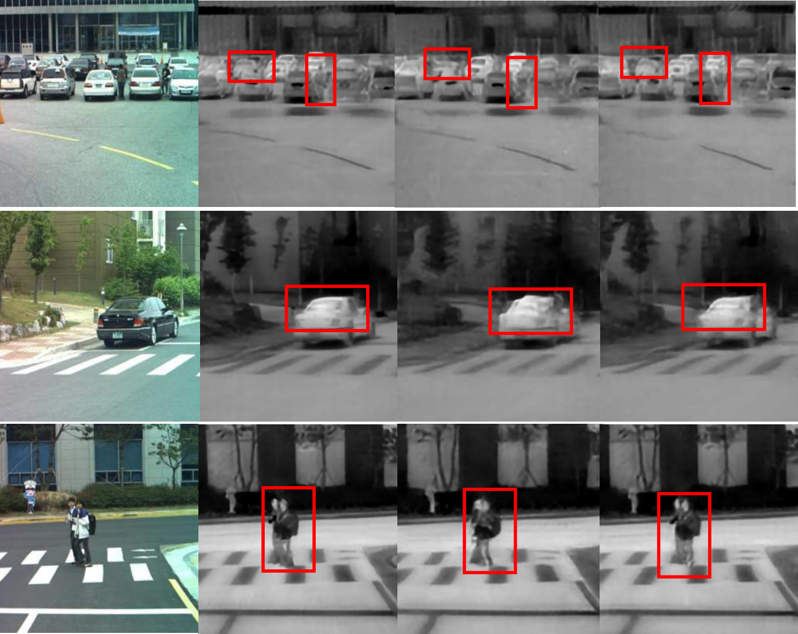
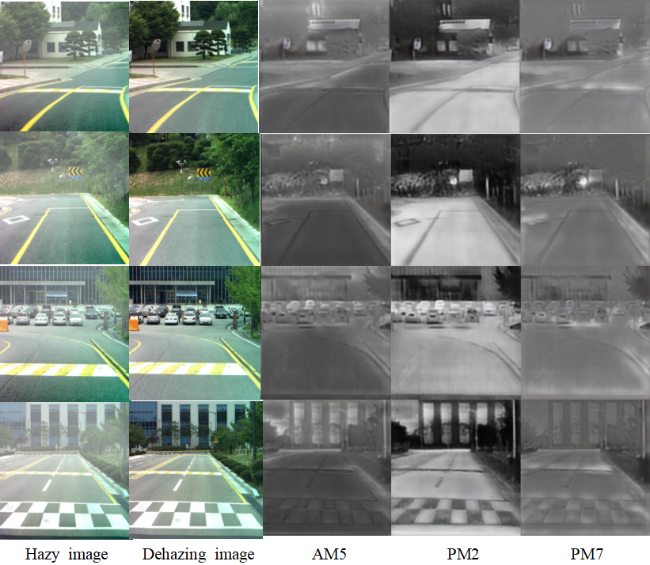
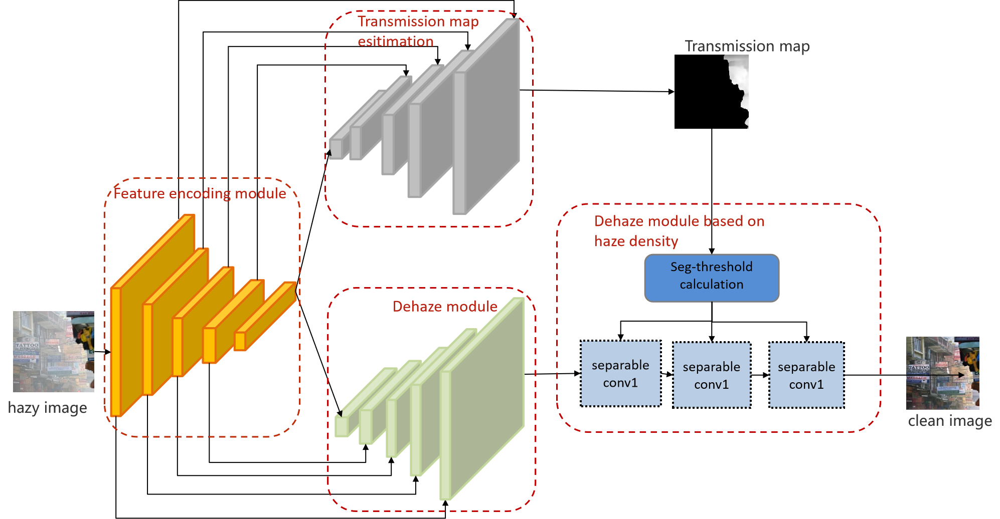
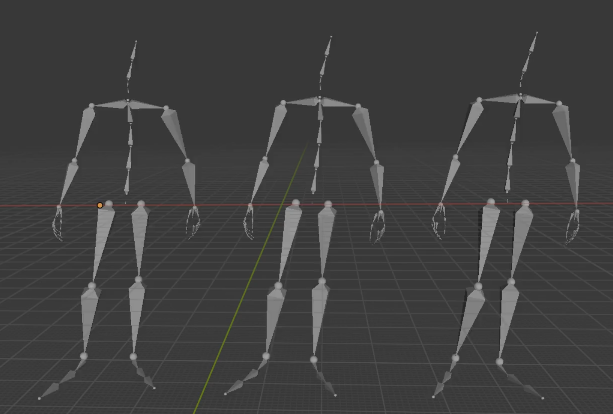
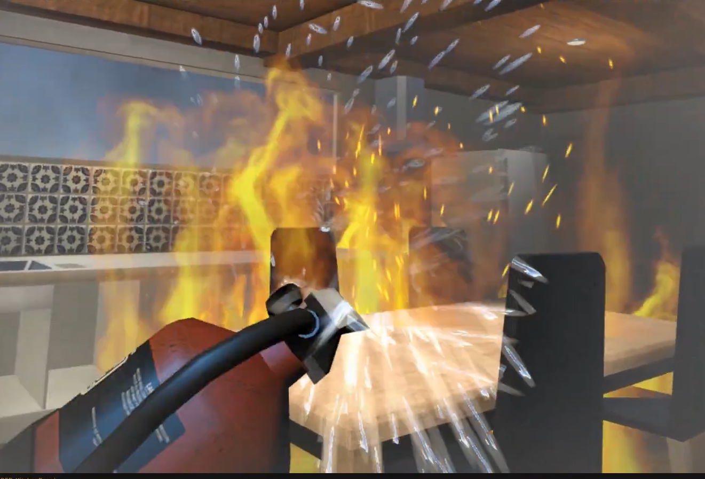
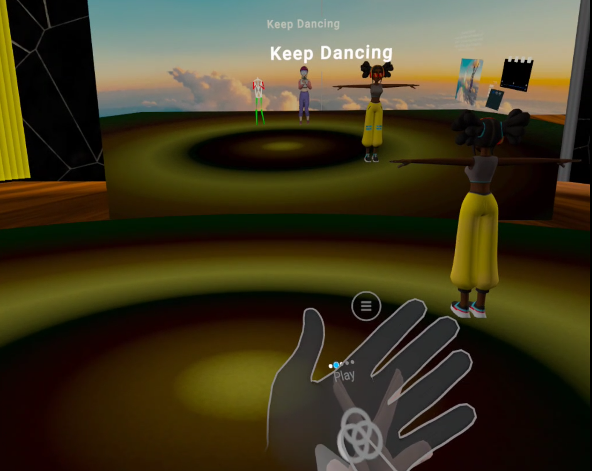

Hi, this is Yanling Hua. I am a second-year (2023~2025) Master's student in the Faculty of Engineering at Lund University. My major is virtual reality and augmented reality (VR/AR).

I am interested in **extended reality (XR) and generative AI**, focusing on the creation of accessible, enriched, 
and personalized experiences. I am particularly drawn to AI-assisted content creation,
specializing in developing controllable and efficient generative AI methods for 3D objects, scenes, and human
motion generation. Additionally, I am passionate about exploring multimodal interaction
design in XR, aiming to simplify and enhance user interactions, making them more intuitive and seamless.

## Background

<table style="width:100%;border:none;border-spacing:0px;border-collapse:separate;margin-right:auto;margin-left:auto;font-size: large">
<tr>
<td style="padding:20px;width:25%;vertical-align:middle;border:none" align="center">
 
</td>
<td style="padding:20px;width:75%;vertical-align:middle;border: none" align="left">
Master Student. Aug. 2023 - Jun. 2025 (Expected) 
<a href="https://www.lth.se/english/">Faculty of Engineering</a> , Major in VR/AR 
<a href="https://www.lunduniversity.lu.se/">Lund University</a> 
</td>
</tr>

<tr>
<td style="padding:20px;width:25%;vertical-align:middle;border:none" align="center">
 
</td>
<td style="padding:20px;width:75%;vertical-align:middle;border: none" align="left">
Master Student. Aug. 2018 - Jun. 2020  
<a href="http://english.aia.hust.edu.cn/">Department of Artificial Intelligence and Automation</a>, Major in Computer Vision 
<a href="https://english.hust.edu.cn/">Huazhong University of Science and Technology</a> 
</td>
</tr>

<tr>
<td style="padding:20px;width:25%;vertical-align:middle;border:none" align="center">
 
</td>
<td style="padding:20px;width:75%;vertical-align:middle;border: none" align="left">
Bachelor Student. Aug. 2014 - Jun. 2018  
<a href="http://ea.hfut.edu.cn/dqzdhen/" target="_blank">Department of Automation</a>, Major in Automation 
<a href="https://en.hfut.edu.cn/" target="_blank">Hefei University of Technology</a> 
</td>
</tr>
</table>    

## Research

<table style="width:100%;border:none;border-spacing:0px;border-collapse:separate;margin-right:auto;margin-left:auto;font-size: large">
<tr>
<td style="padding:20px;width:30%;vertical-align:middle;border:none" align="center">

</td>
<td style="padding:20px;width:70%;vertical-align:middle;border: none" align="left">
<b>Infrared image generation by pix2pix based on multi-receptive field feature fusion</b> 
Yangyang Ma, <b>Yanling Hua</b>, Zhengrong Zuo 
<i>International Conference on Control, Automation and Information Sciences (<b>ICCAIS</b>), 2021</i> 
<a href="../files/ICCAIS_Infrared Image Generation.pdf" target="_blank"><i class="fas fa-fw fa-file-pdf"></i>Paper</a> /
<a href="https://github.com/huayanling/Pix2pix-MRFFF" target="_blank"><i class="fab fa-fw fa-github fa-github"></i>Code</a>
</td>
</tr>
</table>

---

<table style="width:100%;border:none;border-spacing:0px;border-collapse:separate;margin-right:auto;margin-left:auto;font-size: large">
<tr>
<td style="padding:20px;width:30%;vertical-align:middle;border:none" align="center">

</td>
<td style="padding:20px;width:70%;vertical-align:middle;border: none" align="left">
<b>Infrared image period extension algorithm based on StarGAN</b> 
This project and the work mentioned in the second published paper above are parts of my master's thesis aiming for infra image generation. The published papar generate infra images based on rgb images, but this project achieves infra image generation between images from different peroid in a day. 
<a href="../huahua/Infrared image period extension algorithm based on StarGAN.html" target="_blank"><i class="fas fa-fw fa-globe"></i>Projectpage</a> /
</td>
</tr>
</table>

---

<table style="width:100%;border:none;border-spacing:0px;border-collapse:separate;margin-right:auto;margin-left:auto;font-size: large">
<tr>
<td style="padding:20px;width:30%;vertical-align:middle;border:none" align="center">

</td>
<td style="padding:20px;width:70%;vertical-align:middle;border: none" align="left">
<b>Dehazing algorithm based on image fogging degree</b> 
<b>Yanling Hua</b>, Zhengrong Zuo 
<i>MIPPR 2019: Pattern Recognition and Computer Vision. SPIE, 2020</i> 
<a href="../huahua/Dehazing algorithm based on image fogging degree.html" target="_blank"><i class="fas fa-fw fa-globe"></i>Projectpage</a> /
<a href="../files/MIPPR_Dehazing Network based on Haze Density.pdf" target="_blank" ><i class="fas fa-fw fa-file-pdf"></i>Paper</a> /
</td>
</tr>
</table>

## Working Experience

<table style="width:100%;border:none;border-spacing:0px;border-collapse:separate;margin-right:auto;margin-left:auto;font-size: large">
<tr>
<td style="padding:20px;width:30%;vertical-align:middle;border:none" align="center">

</td>
<td style="padding:20px;width:70%;vertical-align:middle;border: none" align="left">
<b>Talking pose generation</b> 
This project is about talking-pose generation and I do this project independently. I tried two ways, motion retrival and end2end motion generation.  
<a href="../huahua/End2end motion generation.html" target="_blank"><i class="fas fa-fw fa-globe"></i>Projectpage</a> /
</td>
</tr>
</table>

---

<table style="width:100%;border:none;border-spacing:0px;border-collapse:separate;margin-right:auto;margin-left:auto;font-size: large">
<tr>
<td style="padding:20px;width:30%;vertical-align:middle;border:none" align="center">

</td>
<td style="padding:20px;width:70%;vertical-align:middle;border: none" align="left">
<b>Semantic Nerf in unbounded scene for autonomous driving</b> 
This project is for the semantic auto-labeling task in the autonomous driving scene and I do this project independently. I use nerf, which has show significant performance in novel view synthesis, to achieve muti-view generation and get the semantic label.  
<a href="../huahua/Semantic Nerf in unbounded scene for autonomous driving scene.html" target="_blank"><i class="fas fa-fw fa-globe"></i>Projectpage</a> /
</td>
</tr>
</table>

---

<table style="width:100%;border:none;border-spacing:0px;border-collapse:separate;margin-right:auto;margin-left:auto;font-size: large">
<tr>
<td style="padding:20px;width:30%;vertical-align:middle;border:none" align="center">

<!-- <video width="350" height="200" loop>
    <source src="../images/bunny-rgb.mp4" type="video/mp4">
    Your browser does not support the video tag.
</video> -->
</td>
<td style="padding:20px;width:70%;vertical-align:middle;border: none" align="left">
<b>3D genration for Game Asset</b> 
This project is about research of constructing 3D models of game assets.  
<a href="../huahua/3D generation.html" target="_blank"><i class="fas fa-fw fa-globe"></i>Projectpage</a> /
</td>
</tr>
</table>

## Projects

<table style="width:100%;border:none;border-spacing:0px;border-collapse:separate;margin-right:auto;margin-left:auto;font-size: large">
<tr>
<td style="padding:20px;width:30%;vertical-align:middle;border:none" align="center">

</td>
<td style="padding:20px;width:70%;vertical-align:middle;border: none" align="left">
<b>Excape the fire</b> 
This project is about a VR program to help people get more information and know how to act in a fire emergency.  
<a href="https://docs.google.com/presentation/d/1bM-EGJqBSkee5mxCemCGwa58hlPwJjeJ/edit#slide=id.p10" target="_blank"><i class="fas fa-fw fa-globe"></i>Presentation and Demo</a> /
</td>
</tr>
</table>

---

<table style="width:100%;border:none;border-spacing:0px;border-collapse:separate;margin-right:auto;margin-left:auto;font-size: large">
<tr>
<td style="padding:20px;width:30%;vertical-align:middle;border:none" align="center">

</td>
<td style="padding:20px;width:70%;vertical-align:middle;border: none" align="left">
<b>HeyDancing</b> 
This project is about a VR/AR application to help users enhance their dance skills in an interactive environment. The system plans to consist of four core modules: motion capture using a fixed multi-camera setup, motion remapping to project captured movements onto 3D
characters, real-time motion correction, and a motion evaluation model that generates an overall performance
score..  
<a href="../files/paperar.pdf" target="_blank"><i class="fas fa-fw fa-file-pdf"></i>Paper</a> /
<a href="https://www.youtube.com/watch?v=pMr3i27rvCM" target="_blank"><i class="fas fa-fw fa-globe"></i>Demo</a> /
</td>
</tr>
</table>

---

<!-- ## Personal
I spend my spare time in reading, watching movies and traveling. Recently I am reading some books related to -->
## Personal
Keep on exploring! Keep on trying!

## Contact
E-mail: ya4736hu-s[AT]student.lu.se

<!--  -->

