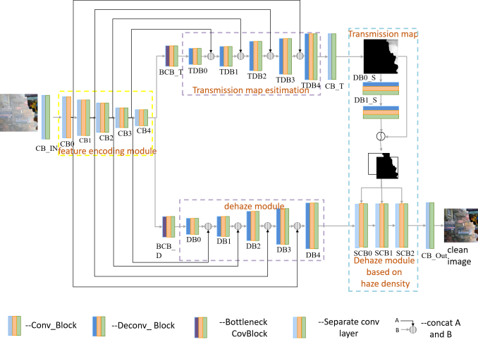
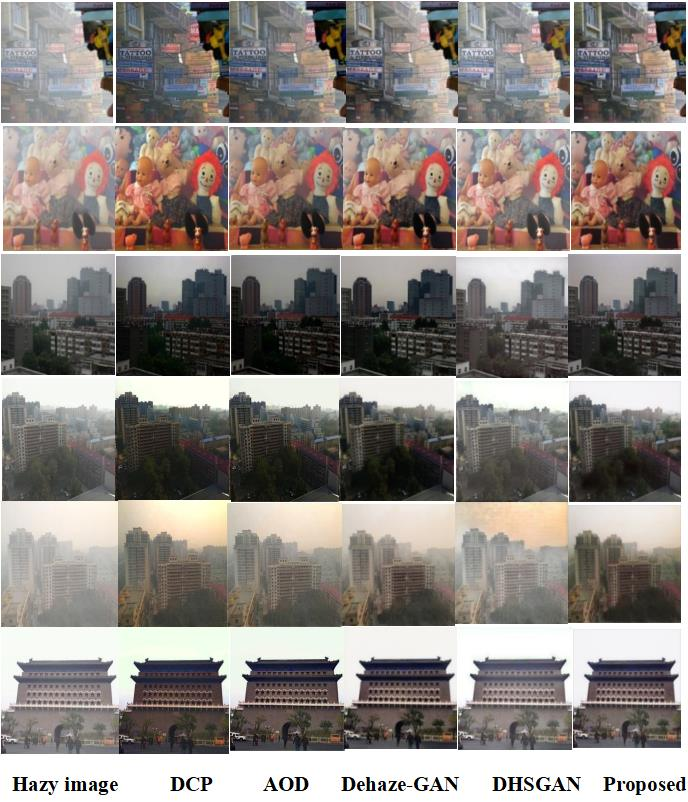

[Aiming at performance degradation of generating infrared images caused by haze on visible images, I propose a dehazing algorithm based on image fogging degree. Considering that the transmission map reflects the fogging degree of hazy images, I built a transmission map prediction module parallel to the dehazing module, called Dehazing Network based on Haze Density (DNBHD). According to the pre-defined threshold, DNBHD can recover different hazy image regions using different output branches.]

This has been published on [MIPPR 2019: Pattern Recognition and Computer Vision, SPIE, 2020](https://www.spiedigitallibrary.org/conference-proceedings-of-spie/11430/114300V/Dehazing-network-based-on-haze-density/10.1117/12.2538200.short#_=_).

In order to further reduce the number of hyperparameters and improve generality, I introduced a threshold adaptive learning module to calculate the segmentation threshold automatically. 

Experiments show that our algorithm achieves good defogging effect on both public datasets and natural images.

This is one part of my master's thesis, and more details can be found in [here](https://kns.cnki.net/kcms/detail/detail.aspx?dbcode=CMFD&dbname=CMFD202201&filename=1020352583.nh&uniplatform=NZKPT&v=4H8aJCBV-4siKEEDgvRtz6C61dKIbZKNLpO5L5kC2Ixm8GDhUCU3j4BfCMunFrIU) (written in Chinese).
