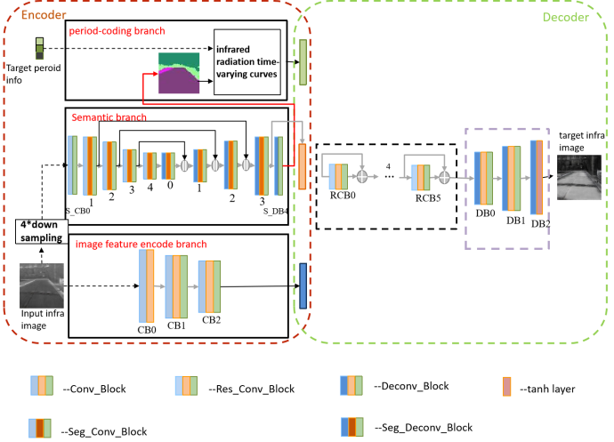
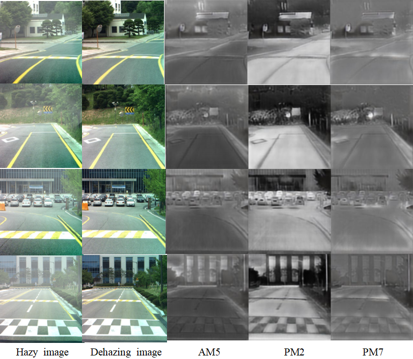

Aiming at the lack of paired multi-period infrared image datasets, I firstly completed an infrared image period extension algorithm based on StarGAN network. The training process is as follows.

In order to solve the problem that StarGAN network gets different results in expanding the same material image region, I propose the semantic constrained StarGAN network. The detail of the net is shown as follows.

On the basis of the StarGAN network, a semantic segmentation branch is added. I inject the scene semantic features into the net and design the semantic consistent loss. Aiming at the problem that the result of the expansion of some material image regions by StarGAN network is wrong, I propose a period-coding method based on semantic segmentation maps and infrared radiation time-varying curves. The training process is as follows.

Experiments show that the semantic constrained StarGAN network is more suitable for the task of infrared image period extension. The following picture shows the results of my full master’s thesis.

This is one part of my master's thesis and more details can be found in [here](https://kns.cnki.net/kcms/detail/detail.aspx?dbcode=CMFD&dbname=CMFD202201&filename=1020352583.nh&uniplatform=NZKPT&v=4H8aJCBV-4siKEEDgvRtz6C61dKIbZKNLpO5L5kC2Ixm8GDhUCU3j4BfCMunFrIU) which is written in Chinese.

