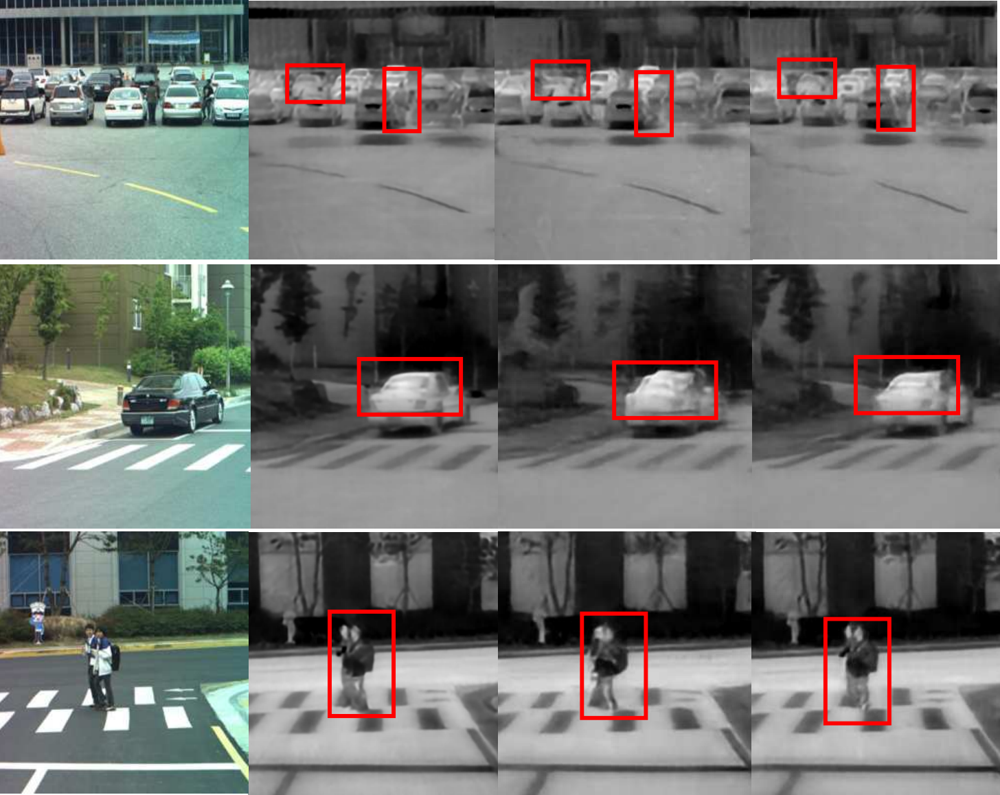

Infrared imaging plays a critical role in a wide range of applications due to its ability to operate in low-light conditions and capture long-range scenes. However, collecting high-quality infrared datasets is labor-intensive and costly. This project tackles the challenge of limited infrared data by leveraging generative adversarial networks (GANs). An improved Pix2pix model with multi-receptive field feature fusion—built on a Unet++ backbone—was developed to generate more detailed and realistic infrared images from visible-light inputs. More details can be found in the paper: [<i class="fas fa-fw fa-file-pdf"></i> Paper](../files/ICCAIS_Infrared%20Image%20Generation.pdf){:target="_blank"}.  
The code is available here: [<i class="fab fa-fw fa-github"></i> Code](https://github.com/huayanling/Pix2pix-MRFFF){:target="_blank"}.

